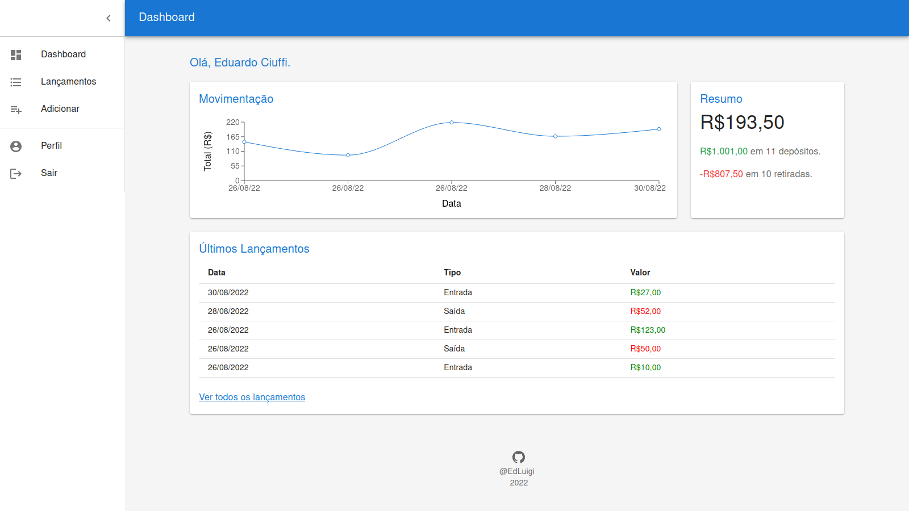
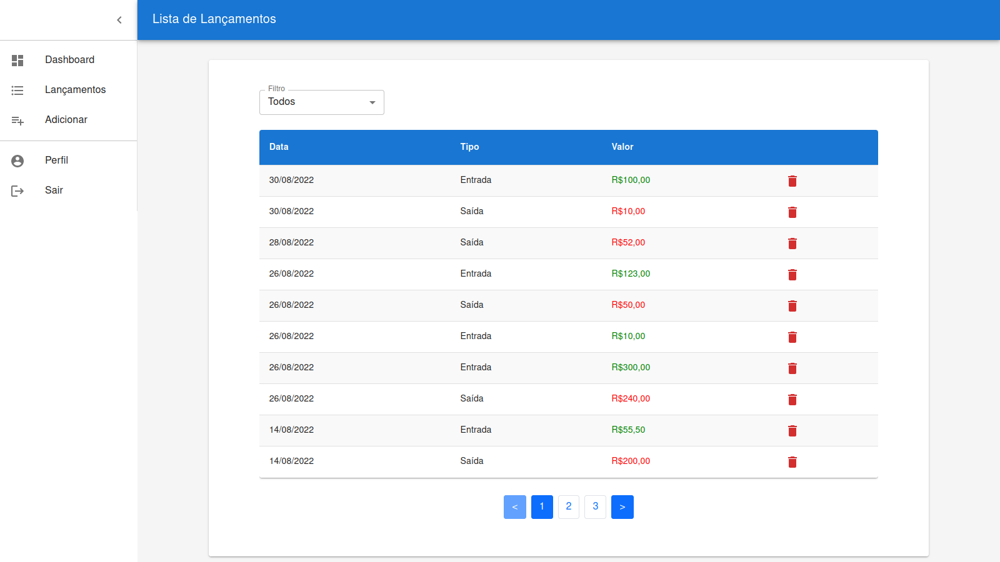
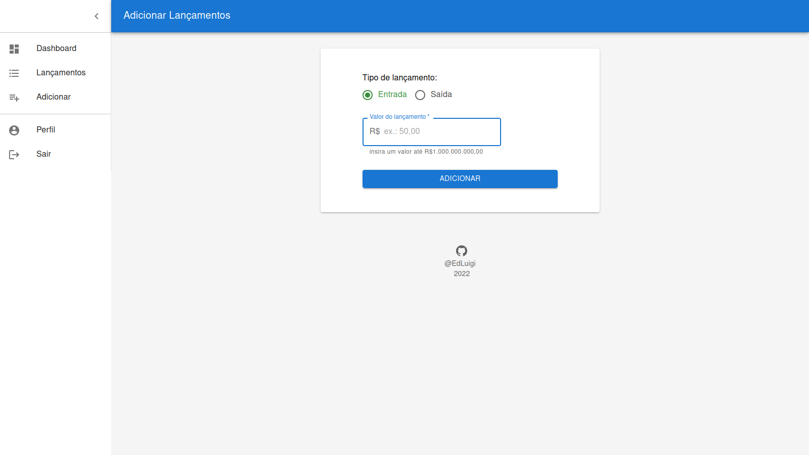

# Financeiro ADM 💰📈

   

Esta aplicação é um projeto pessoal feito com o objetivo de adquirir experiência em desenvolver aplicações para o mercado.
A plataforma Financeiro ADM foi criada para administrar lançamentos financeiros. Desenvolvida com um design responsivo e agradável.

- Dashboard


- Lancamentos


- Adicionar


## Instalação
```sh
cd financeiro-adm
npm install
npm start
```

## Funções
- Login
- Cadastro
- Recuperar Senha
- Dashboard - página principal com gráfico, resumo da conta e últimos lançamentos.
- Lançamentos - listagem dos lançamentos com filtro de visualização e deletar.
- Adicionar - adição de novos lançamentos.
- Perfil - ver dados do perfil e editar.

## Sobre a plataforma
A plataforma Financeiro ADM possui funções de autenticação, administrar lançamentos financeiros, análise de movimentação da conta, modificação de dados pessoais, filtragem na visualização de lançamentos, etc.

Através da página inicial, pode-se ter um resumo da conta e a movimentação a partir dos últimos lançamentos.

## Firebase
O backend da aplicação foi feita com Firebase para administrar usuários e seus dados relacionados.

Atualmente as minhas variáveis de configuração estão inclusas neste repositório, então a aplicação não exige que o desenvolvedor crie um projeto próprio no Firebase para executá-la. Mas no futuro pretendo mudar isso ou talvez atualizar as regras de segurança para evitar ações indesejadas.

## Heroku
A aplicação está hospedada no Heroku!*:

https://financeiro-adm.herokuapp.com/entrar

*temporariamente, já que vão tirar o plano gratuito.
